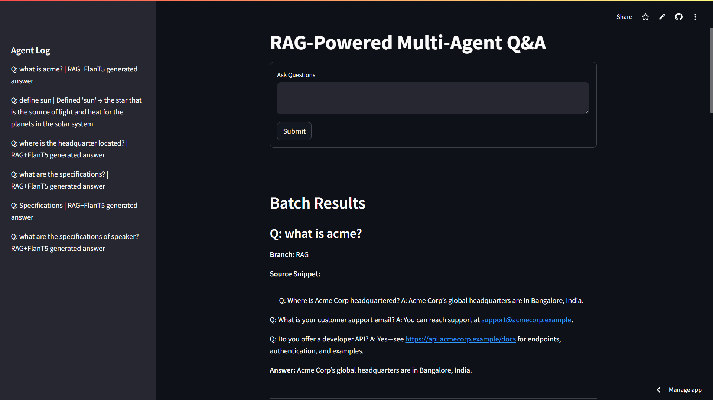

# RAG-Powered Multi-Agent Q&A Assistant

This Streamlit app is a multi-agent Q&A assistant that uses Retrieval-Augmented Generation (RAG) to answer user questions from a small document collection. It reads text documents from `docs/`, indexes them with **FAISS** using SentenceTransformers embeddings. 

It answers queries by 
-  retrieving relevant text chunks.
-  using a generative LLM to form the answer.

If a query contains the word `“calculate”`, the app routes it to a `simple calculator agent`; if it contains `“define”`, it routes to a `WordNet dictionary agent`. Otherwise it performs RAG: it embeds the query (with all-MiniLM-L6-v2) and finds the top relevant chunks from the FAISS index, then combines those snippets with the query to prompt the **Flan-T5-small** LLM for an answer. 

**Demo:** https://rag-poweredmulti-agentq-aassistant-jdzsgxsqhggy9gwbhumy4c.streamlit.app

## Interface

The interface shows the question, which agent branch was taken, the answer, and (for RAG queries) a button to reveal the retrieved context snippets.



_Figure: Example Streamlit interface. The user’s query is submitted in the right panel, the answer is shown below it, and the left panel logs which agent (branch) handled each query. Retrieved document snippets is also shown._

## Architecture

- **Data Ingestion:** The `ingestion.py` script reads all text files in `docs/`, splits them into smaller chunks, and computes vector embeddings using SentenceTransformers (model all-MiniLM-L6-v2). These vectors are stored in a FAISS index for fast similarity search.
  
- **Query Routing / Agents:** When a user submits a question, the app checks for keywords. If “calculate” appears, it runs a Python calculator routine; if “define” appears, it uses NLTK’s WordNet to look up definitions. Otherwise, it enters the RAG pipeline. Each decision is logged (e.g. “Calculator branch”, “Dictionary branch”, or “RAG branch”) in the sidebar.
  
- **Retrieval (RAG branch):** For RAG queries, the app embeds the user query with the same SentenceTransformer model and uses FAISS to retrieve the top-N most similar document snippets (e.g. top 3).
  
- **Generation:** The retrieved snippets are combined with the user’s query to form a prompt for the language model. We use Google’s FLAN-T5-small (a 80M-parameter T5 variant) to generate the answer.
  
- **Interface (Streamlit):** A Streamlit app provides the user interface. There is a text box for the user to input questions, a Submit button, and a display area for the answer. The sidebar shows a running “Agent Log” of each query and which branch was used.

## Key Design Choices

- **Open-Source Components:** We chose only free, open models and tools to avoid any external API requirements. The SentenceTransformers model (all-MiniLM-L6-v2) and Flan-T5-small are both Apache 2.0 licensed. The FAISS library (MIT license) is used for vector search.
  
- **Agent Separation:** The logic for each tool (calculator, dictionary, RAG) is kept modular. Simple keyword checks dispatch the query to one branch. This separation makes the workflow transparent (each decision is logged) and easy to extend with new tools if desired.
  
- **Snippet-Level Retrieval:** Documents are chunked into small passages rather than treating each doc as a whole. This ensures that retrieved context is precise and relevant. This design reflects the standard RAG pipeline: _indexing → retrieval → generation_.

## Setup Instructions

1. **Clone the Repository:** Download or clone this repo to your local machine

2. **Create a Python Environment:** Ensure you have Python 3.7+ installed. It’s recommended to      create a virtual environment.

3. **Install Dependencies:** Run:
   ```bash
   pip install -r requirements.txt
   ```
   This will install Streamlit, `sentence-transformers`, `faiss-cpu`, `transformers`, `nltk`,      and other required packages.
   
4. **Download WordNet Data (if needed):** The dictionary agent uses NLTK’s WordNet. In a Python     console, run:
   ```bash
   import nltk
   nltk.download('wordnet')
   ```
   
5. **Prepare Documents:** Place 3–5 text documents in the `docs/` folder. These can be FAQs,          product specs, or any text you want the assistant to know.

6. **Build the Index:** Run the ingestion script to index the documents:
   ```bash
   python ingestion.py
   ```
   This will chunk the documents and create a FAISS vector index.
   
7. **Launch the App:** Start the Streamlit interface by running:
   ```bash
   streamlit run app.py
   ```
   (Replace `app.py` with the actual script name if different.) This will open a local web          server where you can enter questions.

## Deployment

You can deploy this app either locally or on Streamlit Cloud:

- **Local Deployment:** Follow the setup steps above. Make sure to keep the `docs/` folder and index files accessible. The app will run on `localhost:8501` by default.
  
- **Streamlit Cloud:** Push the code (including `docs/` and `ingestion.py`) to a GitHub repo. Then log in to Streamlit Cloud, create a new app, and connect to your GitHub repo. Specify the main script (e.g. `app.py`) in the Streamlit Cloud settings. The FAISS index can be rebuilt on the cloud by running `ingestion.py` in   the init script or the app’s code. Streamlit Cloud will handle the Python environment based on `requirements.txt`.

## Model Licenses

All major components of the system are open-source and permissively licensed:

- Flan-T5-small (LLM): Apache 2.0 license (no restrictions, can be used and modified freely). No - API key is required since it is run via Hugging Face.
- Sentence-Transformers (all-MiniLM-L6-v2): Apache 2.0 license, used for text embeddings.
- FAISS (vector search): MIT license, used to index and retrieve vectors.
- NLTK WordNet: Free to use, provided by the NLTK library (a permissive license).
- Streamlit: BSD-3-Clause license (open-source web UI).
